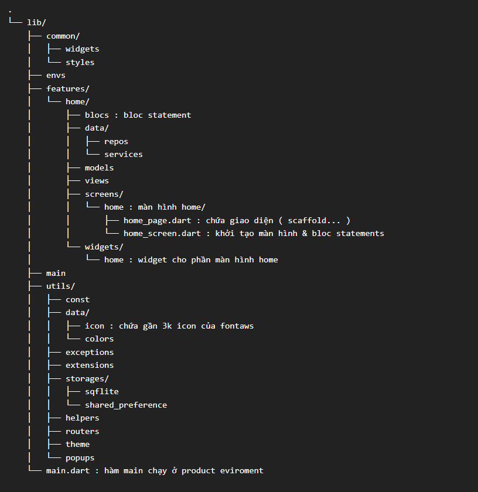

# ✨ Focus App  
     

---

## 🎬 Demo
| STT | Mô tả | Link   |
|--|-----------------|--------|
|  1  | CRUD: task, project, tag. Pomodoro Timer  |  [Link-1](https://drive.google.com/file/d/1mmX2AYYrjWfP5xNm6zeAMOYTAopozfL1/view?usp=sharing) |

---

## 🎯 Mục tiêu
- **Bloc Statement** → ✔️
- **Background Service** → 🔄
- **Native**

---

## 🛠️ Tính năng
- Hiển thị thông báo nhắc nhở & rung chuông (*native Kotlin*)
- Thiết lập thời gian focus (**can't undo**)
- Lock / prevent / limit time for app
- Mật khẩu cho app → mở app hiển thị *passcode*
- Chặn link web cụ thể
- Ghim ghi chú – task cho đến khi hoàn thành

---
# Cấu trúc thư mục [[edit]](https://tree.nathanfriend.com/?s=(%27optZs!(%27fancyF~fullPath!false~trailingSlashF~rootDotF)~L(%27L%27lib6commJzEIstyles6Kvs6featuMI708js5B08QHMpo9HserviceOmodelOviewOscMK9H7N47TpageGAiaYdi%E1%BB%87C%7BVcaffold...%20%7DTscMKG5kh%E1%BB%9Fi%20t%E1%BA%A1o4%26%20BOE9H75E%20chYph%E1%BA%A7n47R6utilIcJstzQ8icJA%E1%BA%A7C3k%20icoCc%E1%BB%A7XfJtawOcolorIexceptZIextKsZIstorage9Hsqflite0HshaMd_pMferKcezhelperIrouterIthemezpopupsRG5h%C3%A0mWaiCch%E1%BA%A1y%20%E1%BB%9F%20product%20eviromKt%27)~versZ!%271%27)*%20%200UH-%204W%C3%A0Ch%C3%ACnh%205N%206U87home8*29s0A5ch%E1%BB%A9XgBjVtatemKtCn%20EwidgetF!trueG.dartH*8I92JonKenLsource!MreN%20%3AO98Qdata0R6mainT0*H7_U%5CnV%20sW%20mXa%20Yo%20ZiJjblocz02%01zjZYXWVUTRQONMLKJIHGFECBA98765420*)
